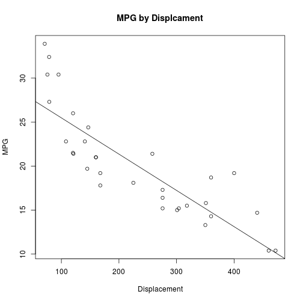

Predicting car gas mileage
========================================================
author: Brennan Cleveland
date: 6/2/2016
autosize: true

Car MPG : Truth and Lies
========================================================

With gas prices fluctuating significantly to as high as $3 USD per 
gallon, gas mileage is a key feature for car purchasers.<br>

However, are car manufacturers acurately reporting their vechicles MPG?<br>

This app will help you find out!<br>

I created a mathmatical model that will predict a car's MPG given it's weight (lbs.) and
engine displacement (cu. inches).

Methodology
========================================================

A linear regression model was created using the data extracted from the 1974 Motor Trend US magazine, 
and comprises fuel consumption and 10 aspects of automobile design and performance for 32 automobiles.<br><br>
Example (showing only MPG, displacement, and weight):

```
                   mpg disp   wt
Mazda RX4         21.0  160 2620
Mazda RX4 Wag     21.0  160 2875
Datsun 710        22.8  108 2320
Hornet 4 Drive    21.4  258 3215
Hornet Sportabout 18.7  360 3440
Valiant           18.1  225 3460
```


Visuals
========================================================



These plots demonstrate a clear relationship between weight, displacement, and MPG.

Model
========================================================
The model was built using Leave One Out cross validation:


```r
library(caret)
tc <- trainControl(method="LOOCV")
m <- train(mpg ~ disp + wt, data=mtcars, method="lm", trControl=tc)
```

The model accuracy using the Multiple R Squared measure is:


```
[1] 76.58223
```

This is the percentage of the variation in MPG in the data explained by the weight and displacement values.

Example and Conclusion
========================================================

Here is an examle prediction for a car weighing 2000lbs with a 250 cu. in. engine:


```
       1 
23.82772 
```
I hope you find this model, and accompanying application, useful as you attempt to validate reported MPG claims
from car manufacturers, or just having fun seeing the relationship between these values and the predicted MPG.
