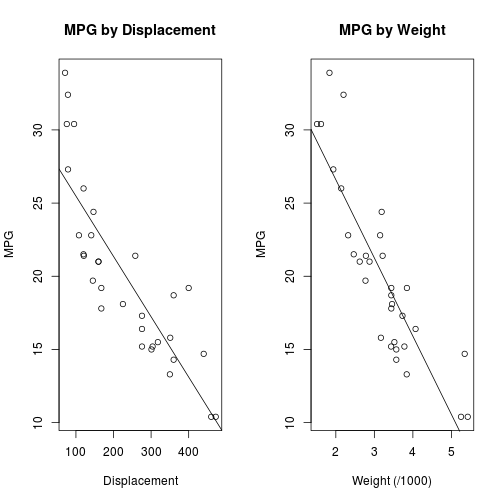

Predicting car gas mileage
========================================================
author: Brennan Cleveland
date: 6/2/2016
autosize: true

Car MPG : Truth and Lies
========================================================

With gas prices fluctuating significantly to as high as $3 USD per 
gallon, gas mileage is a key feature for car purchasers.<br>

However, are car manufacturers acurately reporting their vechicles MPG?<br>

This app will help you find out!<br>

I created a mathmatical model that will predict a car's MPG given it's weight (lbs.) and
engine displacement (cu. inches).

Methodology
========================================================

A linear regression model was created using the 

```
                   mpg disp   wt
Mazda RX4         21.0  160 2620
Mazda RX4 Wag     21.0  160 2875
Datsun 710        22.8  108 2320
Hornet 4 Drive    21.4  258 3215
Hornet Sportabout 18.7  360 3440
Valiant           18.1  225 3460
```

Slide With Plot
========================================================

 
